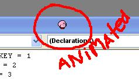

<div align="center">

## Simple Begin of Your Own Screenmate


</div>

### Description

The code let you see how easy it is to make your own screenmate. Import some sounds , more animations and actions.

No Flicker at all!!

Try it out, it is not the most advanced code there is but it is just a little start.

I'll made this code by my selfs, please vote.thanx
 
### More Info
 


<span>             |<span>
---                |---
**Submitted On**   |2004-11-19 20:35:50
**By**             |[Fire2Burn](https://github.com/Planet-Source-Code/PSCIndex/blob/master/ByAuthor/fire2burn.md)
**Level**          |Intermediate
**User Rating**    |4.5 (50 globes from 11 users)
**Compatibility**  |VB 5\.0, VB 6\.0
**Category**       |[Graphics](https://github.com/Planet-Source-Code/PSCIndex/blob/master/ByCategory/graphics__1-46.md)
**World**          |[Visual Basic](https://github.com/Planet-Source-Code/PSCIndex/blob/master/ByWorld/visual-basic.md)
**Archive File**   |[Simple\_Beg18202711202004\.zip](https://github.com/Planet-Source-Code/fire2burn-simple-begin-of-your-own-screenmate__1-57338/archive/master.zip)

### API Declarations

```
Private Const LWA_COLORKEY = 1
Private Const LWA_ALPHA = 2
Private Const LWA_BOTH = 3
Private Const WS_EX_LAYERED = &H80000
Private Const GWL_EXSTYLE = -20
Private Declare Function SetLayeredWindowAttributes Lib "user32" (ByVal hwnd As Long, ByVal color As Long, ByVal x As Byte, ByVal alpha As Long) As Boolean
Private Declare Function SetWindowLong Lib "user32" Alias "SetWindowLongA" (ByVal hwnd As Long, ByVal nIndex As Long, ByVal dwNewLong As Long) As Long
Private Declare Function GetWindowLong Lib "user32" Alias "GetWindowLongA" (ByVal hwnd As Long, ByVal nIndex As Long) As Long
```


